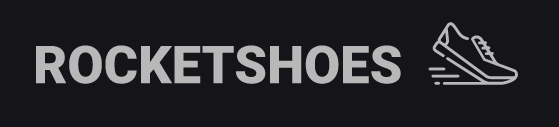
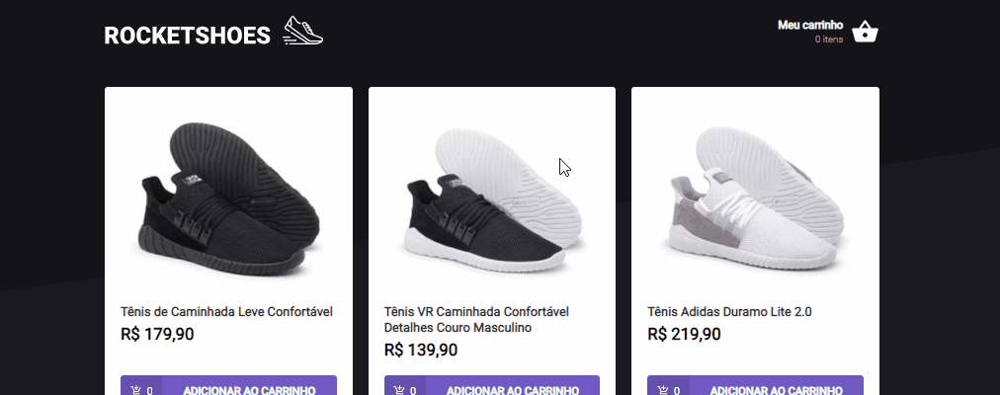

<h1 align="center">
  
</h1>

<h1 align="center">
  
</h1>


## 📋 Sobre

Aplicação que simula o básico de uma loja online. Consiste principalmente da tela principal com a listagem de produtos onde é possível adicionar novos produtos ao carrinho de compras e a tela resumo de compra, onde é possível remover um produto do carrinho, incrementar e/ou decrementar a quantidade do produto no carrinho.

---

## 🎯 Objetivo
Praticar a criação de **hooks customizados** (no exemplo deste projeto, o hook de carrinho de compras para controle de operações ligadas ao carrinho de compras), utilização da localStorage API e utilização de bibliotecas de terceiros como **react-toastify** e **json-server**.

---


## 🚀 Principais Tecnologias utilizadas
- ReactJS + Typescript
- Styled Components
- React Toastify
- JSON Server
---


## 🛠 Como baixar o projeto

```bash

# Clonar o repositório
git clone https://github.com/lucasdsaints/carrinho-compras-reactjs.git

# Entrar no diretório
cd carrinho-compras-reactjs

# Instalar as dependências
yarn # npm install 

# Iniciar a API Fake
yarn server # npm run server 

# Iniciar o projeto
yarn start # npm start 

```

---


Desenvolvido por mim, Lucas A. Santos 😛!
